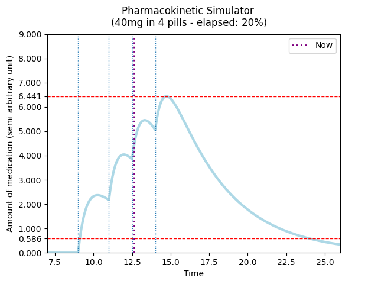
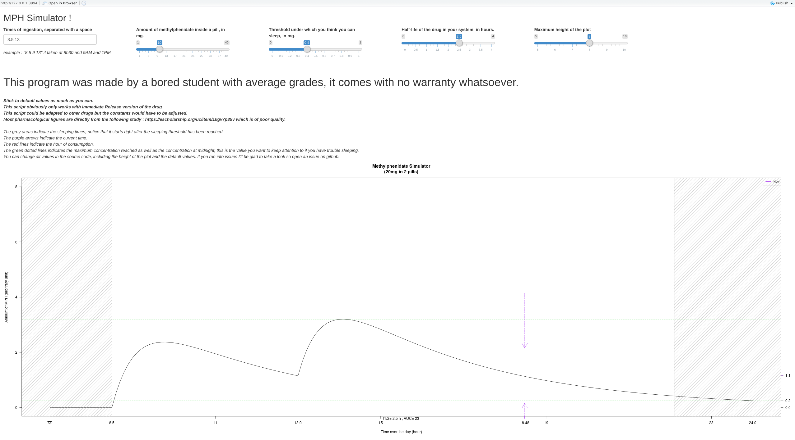

# Pharmacokinetic curve simulator
## What is this? What does it do?
This simple simple coding project was designed to quickly create pharmacokinetic curves of prescription drugs. Initially this was specifically taylored to methylphenidate immediate release tablets ("ritalin") to help a friend take enough to work and not too much to sleep and optimize his schedule.

It can readily be adapted to any immediate release drug if you have the right pharmacokinetic parameters.

2 versions exist:
* A first one in R using the package `Shiny` to create interactive plots. To see examples of it running, please look at the gifs below.
* A second and much improved version using python and not interactive but with more accurate parameters and cleaner code.

*keywords : ADHD, ADD, attention deficit, hyperactivity*

## Notes:

* Made by a bored student, no warranty whatsoever
* I made it for a friend so I can't provide any assistance regarding symptoms, dosage, etc
* Don't hesitate to open an issue if you have **any** question, I'll always take a look
* If you find any typo or error let me know, criticism is **very** welcome.
* All values are from this (*somewhat poor quality*) study  https://escholarship.org/uc/item/9gv7p39v so don't hesitate to tune the parameters to your liking, and do tell me!
* My friend also used the FOSS app [diary](https://github.com/billthefarmer/diary) on his android phone to register his weight and all his drug usage (mg, hour taken etc) so I also did a bit of code to help him import his data into an R database. It's in this repository along with the rest.
* This repository is licensed

## Usage
### In R
* download the latest .R file from this page.
* open it with RStudio (development environment for R language programming, obviously free)
* make sure Shiny is installed : type `install.packages("shiny")` inside the R console, this will install Shiny, a package allowing nice app like display with dynamic updating.
* run the code and adjust the value appearing on screen.
### In python 
* `python ./script.py --hour_taken "[8.15, 12, 14]" --show_plot True`

## In action:
### Python

### R
#### gif

#### Picture

