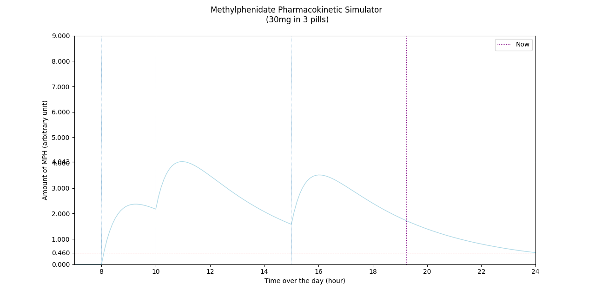

# Methylphenidate-simulator
## What is this? What does it do?
This R code use shiny to simulate the pharmacokinetic of methylphenidate immediat releae tablet to still be able to sleep at night and optimize your day etc. It can be adapted to other drugs. Also (sort of) exists in python. Want to see it in action? Look at the bottom of this page.

*keywords : ADHD, ADD, attention deficit, hyperactivity*

## Notes:

* Made by a bored student with average grades, no waranty whatsoever
* I made it for a friend so I can't provide any assistance regarding any symptoms
* Don't hesitate to open an issue if you have **any** question, I'll always take a look
* If you find any typo or error let me know, citicim is **very** welcome.
* All numbers are from this poor quality study  https://escholarship.org/uc/item/9gv7p39v so don't hesitate to edit the things to what suits you best
* My friend also used the FOSS app [diary](https://github.com/billthefarmer/diary) on his android phone to register his weight and all his drug usage (mg hour etc) so I coded him an importer to import the data in R. It's in this repo.
* This repo is licensed

## Usage
### In R
* download the .R file
* open it with RStudio (developpement environnement for R language programming)
* *optionnal : type install.packages("shiny") inside the R console, this will install Shiny, a package allowing nice app like display with dynamic updating.*
* run the code and adjust the value appearing on screen.
### In python 
* run the code, but it's not as polished
* it should only require matplotlib

## In action:
### R

### Python

